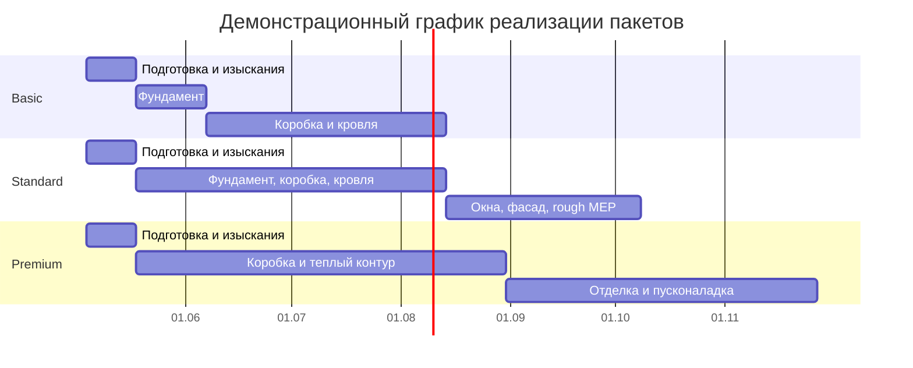
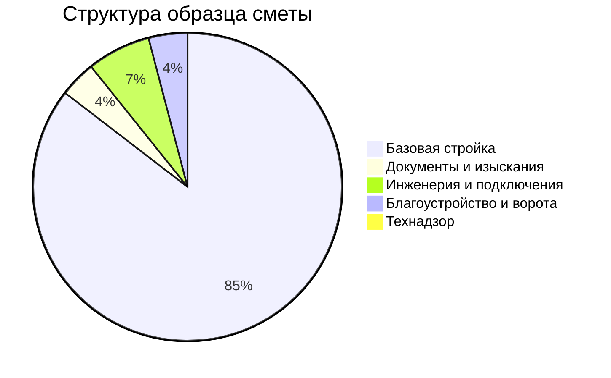

# ТЗ демо-бота Telegram для строительства частных домов в Анапе и Анапском районе

## Резюме для запуска

Для демо-бота по строительству частных домов в Анапе и Анапском районе оптимально строить логику продаж вокруг трех стадийных пакетов: **«коробка»**, **«теплый контур/с фасадом»** и **«дом с отделкой»**. Именно такой формат чаще всего встречается у местных подрядчиков: для одноэтажных домов публично рекламируются ориентиры порядка **30–33 тыс. ₽/м² за коробку**, **40–45 тыс. ₽/м² за дом с фасадом** и **52–57 тыс. ₽/м² за дом с отделкой**; при этом отдельные локальные сайты рекламируют старт **от 40–42,5 тыс. ₽/м²** как минимальный вход в “под ключ” или близкий к нему пакет. Это дает хорошую основу для правдоподобного демо-калькулятора, где пользователь быстро получает смету по площади, а затем добавляет опции: проект, геология, фундамент, инженерия, септик, благоустройство и выезд инженера. citeturn4view0turn4view1turn4view2turn8view1

Для юридически аккуратного UX важно не копировать маркетинговую формулировку “разрешение на строительство” как основную. Для ИЖС в 2026 году корректнее использовать формулировки **«уведомление о планируемом строительстве»** и **«уведомление об окончании строительства»**: именно такой порядок описан на государственных сервисах, хотя локальные коммерческие исполнители по-прежнему продают услугу под старым названием “разрешение”. Поэтому в боте лучше назвать блок **«Документы и уведомления ИЖС»**, а цену брать как рыночный диапазон услуг сопровождения, а не как официальный госплатеж. citeturn21search2turn21search16turn21search4turn15search0turn21search9

## Целевая аудитория и бизнес-кейсы

Основной пользователь такого демо-бота — частный заказчик, который хочет быстро понять **диапазон бюджета**, **разницу между пакетами** и **стоимость допов** без звонка менеджеру. Второй сегмент — теплые лиды из рекламы, которым нужен быстрый первый расчет перед созвоном. Третий сегмент — владельцы участков в пригороде и в Анапском районе, для которых особенно важны не только стены и крыша, но и сопутствующие блоки: геология, септик, вода, газ, ворота, плитка, навес. Такой сценарий хорошо совпадает с тем, как локальные компании продают “полный цикл”: от проектирования и фундамента до коммуникаций и благоустройства. citeturn8view0turn20search2

Для бизнеса бот решает четыре задачи. Во-первых, он квалифицирует лид по бюджету и площади. Во-вторых, объясняет разницу между пакетами без участия менеджера. В-третьих, аккуратно продает add-ons через визуальные карточки. В-четвертых, создает “вау-эффект” за счет быстрой сметы, сравнения пакетов, демо-записи на выезд инженера и выдачи PDF-сметы. Это особенно уместно для Telegram, где решение должно выглядеть как готовый продукт, а не как форма-анкета.

## Ценовая база, источники и допущения

У entity["organization","Росстат","russian statistics agency"] есть региональные витрины по строительству и средней стоимости 1 м², но эти данные агрегированы по entity["state","Краснодарский край","russia"], а не по Анапе. Поэтому для демо-бота приоритет следует дать **локальным русскоязычным прайсам подрядчиков**, далее — **региональным маркетплейсам услуг**, и только затем — **портфолио и классифайдам** как sanity-check. Это соответствует задаче сделать не академическую оценку по краю, а правдоподобный локальный калькулятор для пользователя, который смотрит на публичные предложения именно в Анапе. citeturn6search1turn9search1turn9search2turn9search6

Ниже приведена ценовая база, пригодная для **офлайн mock-data**. Там, где локальные страницы показывают явный публичный прайс, диапазон дан как прямой. Там, где страницы смешивают работу, материалы и маркетинговое “от”, диапазон помечен как **оценка** и должен храниться в mock-данных с флагом `estimated: true`. Все суммы — в рублях, дата среза для ТЗ — **2026-04-20**.

| Позиция | Типовая единица | Реалистичный диапазон для бота | Как использовать в демо | Источники |
|---|---:|---:|---|---|
| Индивидуальное проектирование ЭП / АП / АР+КР / ИР | ₽/м² | 630 / 780 / 980 / 490 | Прямой публичный прайс; удобно считать по площади дома | citeturn4view3 |
| Геология участка под коттедж | проект | 45 000–54 000 | Прямой локальный прайс; для домов >80 м² в боте помечать как estimate-upscale | citeturn14view2turn14view3 |
| Строительство **коробки** | ₽/м² | 30 000–33 000 | Основа пакета Basic; для 1–2 этажей | citeturn4view0 |
| Дом **с фасадом / теплый контур+** | ₽/м² | 40 000–45 000 | Основа пакета Standard | citeturn4view0turn4view2turn20search2 |
| Дом **с отделкой** | ₽/м² | 52 000–57 000 | Основа пакета Premium | citeturn4view0 |
| Газоблок / керамзитоблок / кирпич “под ключ” | ₽/м² | 41 498–42 537 | Удобно как secondary cross-check для локального full-build rate | citeturn8view1 |
| Ленточный фундамент | ₽/п.м. | 3 216–9 439 | Прямой range локальных страниц; в боте считать по периметру и несущим стенам | citeturn4view5turn14view0 |
| Монолитная плита | ₽/м² | 3 216–10 384 | Прямой range; хранить как отдельный тип фундамента | citeturn4view5turn14view0 |
| Свайно-ростверковый фундамент | проект | **оценка** 450 000–950 000 | Собирать как estimate по этапам после геологии; локально есть поэлементные расценки | citeturn14view1turn14view3 |
| Кровля под ключ: профнастил / металлочерепица / фальц | ₽/м² кровли | 1 300–2 200 | Реалистичный публичный диапазон для Roofing add-on | citeturn19view0 |
| Кровельные работы по монтажу, work-only | ₽/м² | 250–500 | Использовать только как запасной коэффициент для estimate | citeturn4view6turn16search14 |
| Утепление фасада / фасадные работы | ₽/м² | **оценка** 700–2 600 | Включает различия по мокрому фасаду, утеплению и “под ключ” | citeturn13search9turn13search2turn13search4 |
| Внутренняя отделка | ₽/м² | 2 500 / 3 500 / 4 500 | Три уровня отделки: косметическая / капитальная / евро | citeturn4view7turn1search2 |
| Электрика по дому | ₽/м² | **оценка** 964–1 393 | Для блока и кирпича диапазон выше; в демо можно считать по площади | citeturn10search12turn4view8 |
| Подключение дома к сети / ввод | проект | от 15 480 | Хранить как фиксированную опцию к внутренней электрике | citeturn10search12 |
| Скважина на воду | ₽/п.м. | 700–2 800 | Зависит от метода и глубины; для демо брать 30–50 м по умолчанию | citeturn3search4turn3search14turn3search7 |
| Водоснабжение / разводка / насосная станция | проект | **оценка** 20 000–120 000 | В локальных прайсах много построчных работ, поэтому нужен assembled estimate | citeturn23view1turn10search1 |
| Септик / автономная канализация | проект | **оценка** 60 000–180 000 | Локальные предложения дают оборудование от ~20–74 тыс. и монтаж “под ключ” от ~17,6–50,8 тыс. | citeturn4view11turn3search12turn3search16 |
| Газификация частного дома | проект | 203 000–300 000 | Прямой локальный прайс; отдельно есть проект и строительство газопровода | citeturn4view9turn3search1 |
| Тротуарная плитка под ключ | ₽/м² | 1 400–4 500 | Сильный upsell для внешнего благоустройства | citeturn19view2turn12search1 |
| Откатные ворота | проект | 65 000–150 000 | Показывать как готовую карточку add-on | citeturn12search2turn12search5 |
| Забор | ₽/п.м. | от 1 410 дерево; от 3 000 металл | Удобно для калькулятора благоустройства | citeturn12search6turn12search10 |
| Навес для авто | проект | 23 700–130 000 | Карточка премиального апселла | citeturn12search3turn12search7 |

Юридический блок для ИЖС в боте лучше строить как **«документы и уведомления»**, а не как “разрешение”. Для рынка услуг можно заложить **СПОЗУ от 5 500 ₽**, “сопровождение разрешения/уведомления” около **16 500 ₽** по локальным прайсам, а помощь с уведомлением об окончании — **от 15 000 ₽** по профильным юрсервисам; при этом пользовательскому интерфейсу лучше объяснять, что это **коммерческое сопровождение**, а не государственный тариф. citeturn15search0turn21search2turn21search16turn21search9

## Допуслуги и демо-пакеты

Локальные строительные сайты продают не только коробку дома, но и полный цикл: проектирование, фундамент, крышу, инженерные системы, подключение электричества, канализацию, отопление, благоустройство и опции вроде плитки, забора, ворот, вентиляции, септика и навеса. Именно поэтому демо-бот должен выглядеть не как “строительный прайс”, а как **конструктор объекта** с апселлами. citeturn8view0

### Общий каталог допуслуг для mock-data

| Add-on | Типовая цена | Краткое описание для карточки в боте | Статус |
|---|---:|---|---|
| Геология участка | 45 000–54 000 ₽ | Исследование грунта перед выбором фундамента | прямой прайс citeturn14view2turn14view3 |
| АР+КР проект | 980 ₽/м² | Архитектура + конструктив для стройки | прямой прайс citeturn4view3 |
| Инженерный проект | 490 ₽/м² | Электрика, отопление, ВК | прямой прайс citeturn4view3 |
| Upgrade фундамента: плита / свайно-ростверк | 120 000–550 000 ₽ к базовой смете | Для сложного грунта или слабых оснований | оценка citeturn14view0turn14view1turn14view3 |
| Кровля premium | +300–900 ₽/м² кровли | Замена профнастила на металлочерепицу/фальц | частично прямой, частично estimate citeturn19view0turn16search14 |
| Утепление/фасад | 700–2 600 ₽/м² | Мокрый фасад, утепление, штукатурка/облицовка | estimate from local tariffs citeturn13search9turn13search2turn13search13 |
| Внутренняя отделка | 2 500–4 500 ₽/м² | Базовая, капитальная, евро | прямой прайс citeturn4view7 |
| Электрика дома | 100 000–220 000 ₽ на 100–120 м² | Разводка, щит, стартовый ввод | estimate from local tariffs citeturn10search12turn17search12 |
| Вода / скважина | 70 000–180 000 ₽ | Скважина, насос, стартовая разводка | estimate from local depth and service rates citeturn3search4turn23view1 |
| Септик | 60 000–180 000 ₽ | Автономная канализация для дома | estimate from local market ads and catalogs citeturn4view11turn3search12turn3search16 |
| Газификация | 203 000–300 000 ₽ | Подключение частного дома к газу | прямой локальный прайс citeturn4view9 |
| Плитка/дорожки | 1 400–4 500 ₽/м² | Мощение, основание, бордюры | прямой локальный прайс citeturn19view2 |
| Забор / ворота / навес | 1 410 ₽/п.м+, 65 000 ₽+, 23 700 ₽+ | Блок благоустройства и внешнего контура | прямой прайс / маркетинговый from-price citeturn12search6turn12search2turn12search3 |
| Документы и уведомления ИЖС | 15 000–35 000 ₽ | СПОЗУ, сопровождение уведомлений | estimate from legal and local service pages citeturn15search0turn21search2turn21search9 |
| Технадзор / сопровождение | 3 000–11 000 ₽ за выезд; 10 000–30 000 ₽/мес; 120 000 ₽/мес геодезическое сопровождение | Контроль строительства и отчетность | mixed sources, mark configurable citeturn20search3turn18search2turn22view1turn20search7 |

### Демонстрационные пакеты

Ниже — **синтетические пакеты** для бота. Они собраны из локальных диапазонов “коробка / фасад / с отделкой” и специально приведены к удобному виду для Telegram-калькулятора: одна и та же базовая модель дома **100 м², 1 этаж, простой прямоугольник, без подвала, участок и покупка земли не входят**, фундамент и финальные сети считаются по “среднему” варианту. Это не коммерческая оферта, а правильные **mock estimates** для демо. citeturn4view0turn4view1turn4view2turn8view1

| Пакет | Что входит | Демо-смета | Срок | Комментарий |
|---|---|---:|---:|---|
| **Basic** | Изыскания-старт, базовый фундамент, несущие стены и перегородки, кровля без чистовой инженерии и отделки | **3 200 000 ₽** | 90–120 дней | База для лидов, которые хотят понять “сколько стоит начать” |
| **Standard** | Все из Basic + окна и входная группа, фасад и утепление, утепление кровли, черновая электрика/сантехника | **4 250 000 ₽** | 140–180 дней | Лучший пресейл-пакет для сравнения |
| **Premium** | Все из Standard + внутренняя отделка, отопление/котельная старт, чистовая электрика и сантехника, подготовка к сдаче | **5 500 000 ₽** | 180–240 дней | Демо “почти заезжай и живи” |

Разбивка пакетов по строкам для mock JSON может выглядеть так: **Basic = 70 000 ₽ старт/изыскания + 900 000 ₽ фундамент + 1 350 000 ₽ стены + 580 000 ₽ кровля + 300 000 ₽ орграсходы**, **Standard = Basic + 320 000 ₽ окна/дверь + 360 000 ₽ фасад/утепление + 280 000 ₽ rough MEP + 90 000 ₽ подшив/дренаж/утепление кровли**, **Premium = Standard + 450 000 ₽ отделка + 320 000 ₽ отопление + 360 000 ₽ clean MEP + 120 000 ₽ сдача/клининг**. Это удобная структура для выдачи покомпонентной сметы в Telegram и для PDF. Основание для базовых ставок — локальные диапазоны по стадиям строительства; сроки — estimate из локальных обещаний “от 6 месяцев” для полноценного дома и региональных примеров объектов 100 м²/150 м². citeturn4view0turn4view2turn9search9turn9search6

Ниже — mermaid-шаблон для визуального сравнения сроков пакетов. Он синтетический, но опирается на локальные сроки “от 6 месяцев” для полноценной стройки и на более короткую длительность для коробки/тёплого контура. citeturn4view2turn9search9turn9search6



### Образец сметы для демо-выгрузки

Ниже — **образец одной сметы**, которую бот должен уметь показывать и отправлять в мок-PDF. Сценарий: **дом 110 м², пакет Standard**, пользователь добавил проект, геологию, септик, скважину, старт электротехники, мощение, ворота и 3 выезда технадзора. Там, где локальный рынок не дает единый house-package price, позиция честно помечается как estimate. citeturn4view3turn14view2turn4view11turn3search4turn10search12turn19view2turn12search2turn20search3

| Позиция | Формула для mock | Сумма |
|---|---|---:|
| Пакет Standard | 110 × 42 000 ₽ | 4 620 000 ₽ |
| АР+КР проект | 110 × 980 ₽ | 107 800 ₽ |
| Инженерный проект | 110 × 490 ₽ | 53 900 ₽ |
| Геология участка | фикс. | 45 000 ₽ |
| Септик | fixed-estimate | 95 000 ₽ |
| Скважина и стартовое водоснабжение | fixed-estimate | 85 000 ₽ |
| Старт электрики и ввод | fixed-estimate | 180 000 ₽ |
| Тротуарная плитка 50 м² | 50 × 1 800 ₽ | 90 000 ₽ |
| Откатные ворота | фикс. | 130 000 ₽ |
| Технадзор, 3 выезда | 3 × 10 000 ₽ | 30 000 ₽ |
| **Итого** |  | **5 436 700 ₽** |

Структура этой сметы удобна для диаграммы затрат. Визуально полезно показывать пользователю, что львиная доля бюджета — это базовый пакет строительства, а документы, инженерные допы и благоустройство — уже надстройка поверх него.



## Функциональное ТЗ бота

Бот должен быть написан на **Node.js + Telegraf**, без БД и без внешних платных API. Все данные — локальные mock JS-объекты. Архитектура должна быть LLM-ready: понятные нейросети имена переменных, отдельные данные и отдельная логика расчета, отсутствие “магических чисел” внутри сцен. Базовый пользовательский путь: `/start` → выбор сценария → расчет по пакету → добавление допов → выдача сметы → запрос звонка / запись на выезд / PDF / галерея.

### UX-потоки

`/start` должен показывать шесть базовых веток: **«Рассчитать дом»**, **«Сравнить пакеты»**, **«Доп. услуги»**, **«Галерея»**, **«Записать выезд инженера»**, **«Получить PDF-смету»**. Логика расчета должна идти через пошаговый wizard: локация → площадь → этажность → пакет → фундамент → допы → итог. После итоговой сметы пользователь должен видеть кнопки **«Добавить опции»**, **«Сравнить с Premium»**, **«Получить PDF»**, **«Заказать звонок»** и **«Записать выезд»**.

Для “вау-эффекта” нужно не просто отдавать цифры, а симулировать работу сметчика:  
`🧱 Считаю фундамент...` → `🏠 Подбираю комплектацию...` → `📐 Формирую предварительную смету...` → итог.  
Это позволяет даже с mock-данными сделать опыт похожим на реальный продукт.

### Mermaid-поток бота

```mermaid
flowchart TD
    A[/start] --> B{Что нужно?}
    B --> C[Рассчитать дом]
    B --> D[Сравнить пакеты]
    B --> E[Доп. услуги]
    B --> F[Галерея]
    B --> G[Записать выезд]
    B --> H[Получить PDF]

    C --> C1[Выбрать локацию]
    C1 --> C2[Выбрать площадь]
    C2 --> C3[Выбрать этажность]
    C3 --> C4[Выбрать пакет]
    C4 --> C5[Выбрать фундамент]
    C5 --> C6[Добавить допы]
    C6 --> C7[Показать смету]

    C7 --> H
    C7 --> G
    C7 --> I[Заказать звонок]
    D --> C7
    E --> C6
    F --> J[Показать фото-галерею]
```

### Файловая структура

```text
bot.js
scenes/
  start.scene.js
  calculator.scene.js
  compare.scene.js
  addons.scene.js
  callback.scene.js
  visit.scene.js
  gallery.scene.js
data/
  services.js
  messages.js
utils/
  estimate.js
  pdf.js
  keyboards.js
  formatters.js
assets/
  gallery/
```

### Модель данных

`data/services.js` должен хранить **регион**, **допущения**, **пакеты**, **допы**, **галерею**, **карту**, а также флаг достоверности цены. Важно, чтобы нейросети было легко продолжить этот файл без переписывания архитектуры.

```js
export const regionConfig = {
  regionName: "Анапа и Анапский район",
  currency: "RUB",
  locale: "ru-RU",
  asOfDate: "2026-04-20",
  assumptions: [
    "Цены демонстрационные и не являются офертой",
    "Участок и покупка земли не входят",
    "Для ИЖС использовать формулировку 'уведомление', а не 'разрешение'",
    "Если на сайте источника указано только 'от', хранить isEstimated: true"
  ],
  mapLink: "https://yandex.ru/maps/?text=Анапа"
};

export const packages = [
  {
    id: "basic_box",
    title: "Basic",
    subtitle: "Коробка",
    baseRatePerM2: 32000,
    baseAreaM2: 100,
    timelineDays: [90, 120],
    estimated: false,
    includes: [
      "Изыскания-старт",
      "Базовый фундамент",
      "Несущие стены и перегородки",
      "Кровля"
    ]
  },
  {
    id: "standard_shell",
    title: "Standard",
    subtitle: "Теплый контур + фасад",
    baseRatePerM2: 42500,
    baseAreaM2: 100,
    timelineDays: [140, 180],
    estimated: true,
    includes: [
      "Все из Basic",
      "Окна и входная группа",
      "Фасад и утепление",
      "Черновая электрика и сантехника"
    ]
  },
  {
    id: "premium_ready",
    title: "Premium",
    subtitle: "С отделкой",
    baseRatePerM2: 55000,
    baseAreaM2: 100,
    timelineDays: [180, 240],
    estimated: true,
    includes: [
      "Все из Standard",
      "Внутренняя отделка",
      "Отопление",
      "Чистовая электрика и сантехника",
      "Подготовка к сдаче"
    ]
  }
];

export const addons = [
  { id: "geology", title: "Геология участка", pricingMode: "fixed", min: 45000, max: 54000, defaultValue: 45000, unit: "проект", estimated: false },
  { id: "project_ar_kr", title: "Проект АР+КР", pricingMode: "per_m2", min: 980, max: 980, defaultValue: 980, unit: "м2", estimated: false },
  { id: "engineering_project", title: "Инженерный проект", pricingMode: "per_m2", min: 490, max: 490, defaultValue: 490, unit: "м2", estimated: false },
  { id: "foundation_upgrade", title: "Апгрейд фундамента", pricingMode: "fixed", min: 120000, max: 550000, defaultValue: 220000, unit: "проект", estimated: true },
  { id: "septic", title: "Септик", pricingMode: "fixed", min: 60000, max: 180000, defaultValue: 95000, unit: "проект", estimated: true },
  { id: "well_water", title: "Скважина и вода", pricingMode: "fixed", min: 70000, max: 180000, defaultValue: 85000, unit: "проект", estimated: true },
  { id: "gas", title: "Газификация", pricingMode: "fixed", min: 203000, max: 300000, defaultValue: 250000, unit: "проект", estimated: false },
  { id: "paving", title: "Тротуарная плитка", pricingMode: "per_m2", min: 1400, max: 4500, defaultValue: 1800, unit: "м2", estimated: false },
  { id: "gates", title: "Откатные ворота", pricingMode: "fixed", min: 65000, max: 150000, defaultValue: 130000, unit: "проект", estimated: false },
  { id: "supervision_visit", title: "Технадзор", pricingMode: "per_unit", min: 3000, max: 11000, defaultValue: 10000, unit: "выезд", estimated: true }
];

export const gallery = [
  { id: "gallery_01", stage: "Фундамент", query: "concrete foundation house construction" },
  { id: "gallery_02", stage: "Кладка стен", query: "gas block house construction" },
  { id: "gallery_03", stage: "Кровля", query: "metal roof installation house" },
  { id: "gallery_04", stage: "Фасад", query: "modern house facade exterior" },
  { id: "gallery_05", stage: "Интерьер", query: "new home interior finishing" },
  { id: "gallery_06", stage: "Участок", query: "house front yard landscaping" }
];
```

### Логика расчета

`utils/estimate.js` должен брать площадь, пакет, этажность, материал и выбранные допы, а затем собирать итоговую смету в одном месте. Желательно, чтобы функция возвращала не только total, но и **разбитые строки**, **условные сроки**, **флаг estimated**, **список допущений** и **текст для PDF**.

```js
export function buildEstimate({
  areaM2,
  floors = 1,
  packageId,
  selectedAddOnIds = [],
  selectedAddOnValues = {},
  wallMaterial = "gas_block",
  location = "anapa"
}) {
  // 1. найти пакет
  // 2. посчитать basePrice = areaM2 * package.baseRatePerM2
  // 3. применить коэффициент этажности (например, 1.08 для 2 этажей)
  // 4. применить коэффициент материала, если нужен
  // 5. добавить опции из addons
  // 6. вернуть lineItems, totalPrice, timelineDays, estimatedFlags, assumptions
}
```

### Примеры сообщений и кнопок

```js
export const messages = {
  start: "🏡 Добро пожаловать!\nЯ покажу ориентировочную стоимость строительства дома в Анапе и Анапском районе.\n\nВыберите, что хотите сделать:",
  chooseService: "Что вас интересует?",
  chooseArea: "📐 Выберите площадь дома:",
  choosePackage: "📦 Выберите пакет строительства:",
  chooseFoundation: "🧱 Какой фундамент считаем?",
  chooseAddons: "➕ Добавим опции к смете?",
  estimateReady: "💰 Предварительная смета готова.\nЭто демонстрационный расчет, не оферта.",
  callbackDone: "✅ Отлично! В демо-режиме заявка принята. Менеджер свяжется с вами в ближайшее время.",
  visitDone: "📍 Демозапись на выезд инженера создана. Мы подтвердим визит звонком.",
  pdfReady: "📄 PDF-смета готова. Отправляю документ..."
};

export const keyboards = {
  start: [
    [{ text: "🏗 Рассчитать дом", callback_data: "flow_calc" }],
    [{ text: "📊 Сравнить пакеты", callback_data: "flow_compare" }],
    [{ text: "🧩 Доп. услуги", callback_data: "flow_addons" }],
    [{ text: "🖼 Галерея", callback_data: "flow_gallery" }],
    [{ text: "📍 Записать выезд", callback_data: "flow_visit" }],
    [{ text: "📄 Получить PDF", callback_data: "flow_pdf" }]
  ],
  area: [
    [{ text: "80 м²", callback_data: "area_80" }, { text: "100 м²", callback_data: "area_100" }],
    [{ text: "120 м²", callback_data: "area_120" }, { text: "150 м²", callback_data: "area_150" }]
  ],
  packages: [
    [{ text: "Basic", callback_data: "pkg_basic_box" }],
    [{ text: "Standard", callback_data: "pkg_standard_shell" }],
    [{ text: "Premium", callback_data: "pkg_premium_ready" }]
  ],
  estimateActions: [
    [{ text: "➕ Добавить опции", callback_data: "estimate_addons" }],
    [{ text: "📊 Сравнить с Premium", callback_data: "compare_premium" }],
    [{ text: "📄 PDF-смета", callback_data: "send_pdf" }],
    [{ text: "📞 Заказать звонок", callback_data: "request_callback" }],
    [{ text: "📍 Записать выезд", callback_data: "schedule_visit" }]
  ]
};
```

Для галереи нужен `replyWithMediaGroup`, для PDF — `replyWithDocument`, для карты — inline-кнопка `url`, которая ведет на `mapLink`. Демо-запись на выезд должна предлагать 3–4 статических слота, например: `Вт 11:00`, `Чт 15:00`, `Сб 12:00`, а затем подтверждать запись без реальной CRM-интеграции.

## Визуал, ограничения и требования к LLM-выходу

Для визуала лучше использовать **Unsplash/Pexels**, а не случайные локальные страницы. Для русскоязычного Telegram-бота практика показывает, что англоязычные поисковые запросы для стоков дают более предсказуемые результаты. Минимальный набор запросов: `modern single story house exterior`, `concrete foundation house construction`, `gas block house construction`, `metal roof installation`, `new home interior finishing`, `house front yard landscaping`, `construction engineer site visit`. Фото следует привязать к стадиям проекта, а не просто собрать “красивые дома”: это делает галерею полезной в продажах.

Ограничения для реализации должны быть жестко зафиксированы: **без БД**, **без платных API**, **без удаленного запроса цен на лету**, **только mock/offline data**, валюта только **₽**, локаль **ru-RU**, формат чисел через `Intl.NumberFormat('ru-RU')`, все тексты — на русском, а любые цены с сомнительной точностью должны выводиться как **«ориентировочно»** или **«предварительно»**. Для правовой аккуратности все PDF и сообщения с итоговой сметой должны содержать дисклеймер **«Демо-расчет, не является публичной офертой»**. Для ИЖС в России блок документов следует называть **«уведомления и сопровождение»**, а не “разрешение”, хотя сам рыночный ценник можно брать из локальных коммерческих страниц и юрсервисов. citeturn21search2turn21search16turn21search4turn15search0

Выход, который должна сгенерировать нейросеть по этому ТЗ, должен быть **LLM-ready**: понятные имена переменных, чистые JS-структуры, отдельные сцены, отдельные utilities, отсутствие жестко зашитых цен в логике сцен, наличие поля `estimated`, наличие массива `assumptions`, возможность легко заменить mock JSON на реальный источник позже. Сам бот должен выглядеть как продающий demo-MVP: быстро считает, красиво сравнивает пакеты, показывает add-ons карточками, умеет “записать” на выезд, отдать PDF-смету и показать галерею объектов.